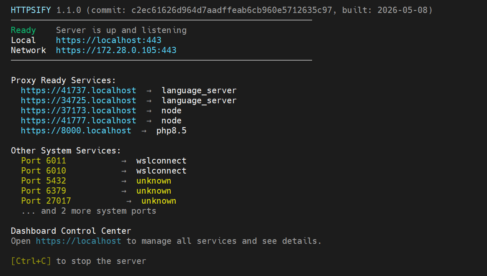
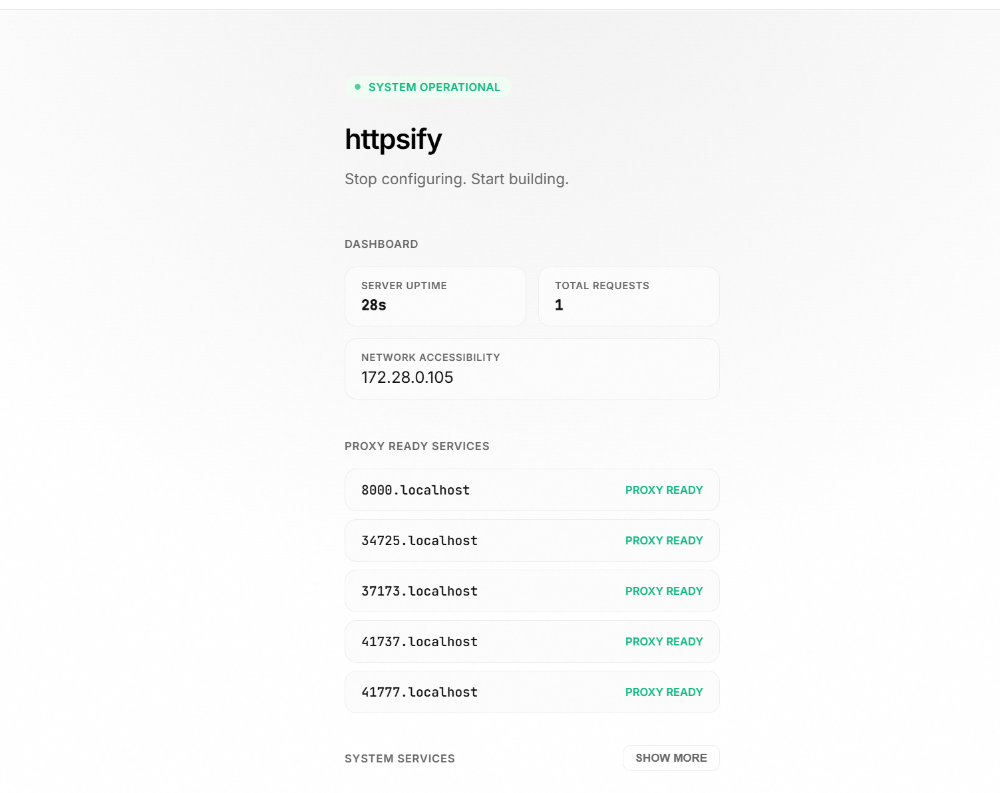
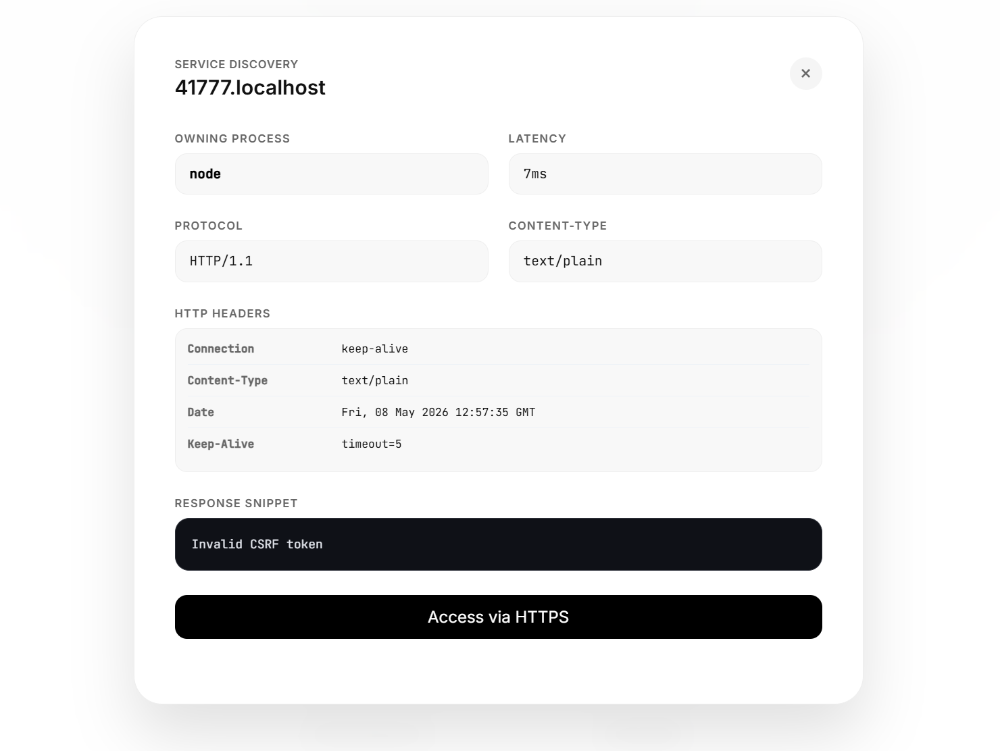
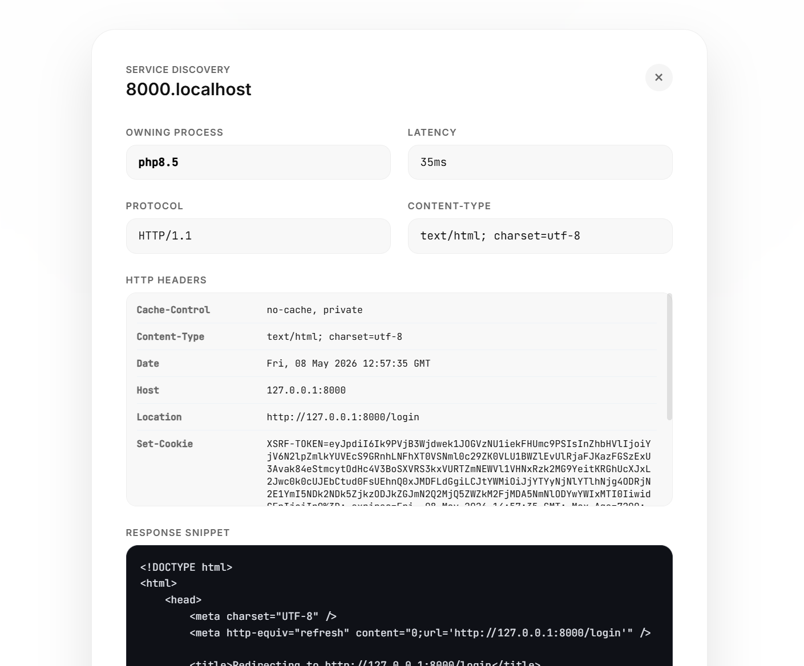

<p align="center">
  
</p>

<h1 align="center">HTTPSify</h1>

<p align="center">
  <strong>The Ultimate Developer Control Center for Local Infrastructure.</strong>
  <br/>
  One binary. Zero configuration. Instant observability.
</p>

<p align="center">
  <a href="https://github.com/imcanugur/httpsify/releases"></a>
  <a href="https://github.com/imcanugur/httpsify/actions"></a>
  <a href="https://github.com/imcanugur/httpsify/blob/main/LICENSE"></a>
</p>

<br/>

<p align="center">
  
</p>

---

## ⚡ The Modern Problem
Modern development is fragmented. You have a **React** frontend on `:3000`, a **Laravel** API on `:8000`, and a **Python** worker on `:5000`. 
Getting HTTPS to work across all of them for OAuth testing, secure cookies, or service workers is a nightmare of Nginx configs and certificate management.

## 🚀 The HTTPSify Solution
`httpsify` transforms your local network into a professional-grade development environment with a single command. It automatically discovers your running services and maps them to secure subdomains.

```bash
sudo httpsify
```

**Zero Configuration Required:**
- `https://3000.localhost` → Maps to your React app
- `https://8000.localhost` → Maps to your PHP/Node API
- `https://80.localhost`   → Maps to your local system service

---

## 💎 Key Features

### 🔍 Service Discovery 2.0
HTTPSify doesn't just proxy; it **observes**. Using a high-performance `/proc` scanning engine with a **Bounded Worker Pool**, it identifies active processes (PID/Name) and provides real-time health diagnostics.

### 📊 Developer Control Center
Access a premium, low-latency web dashboard at `https://localhost` to manage your entire local stack.

<p align="center">
  
</p>

### 🩺 Deep Diagnostics
Inspect headers, latency, protocol versions, and response snippets for any local service without leaving your browser.

<p align="center">
  
</p>
<p align="center">
  
</p>

---

## 🛠 Engineering Standards

HTTPSify is built with production-grade engineering principles:

- **Performance**: High-frequency request path is optimized with **IP Caching** to eliminate redundant syscalls.
- **Concurrency**: Service discovery uses a **Worker Pool** (32+ workers) to prevent resource exhaustion and spike-free scanning.
- **Observability**: Structured **Text Logging** with unique Request IDs for end-to-end tracing.
- **Connection Pooling**: Reuses optimized `http.Transport` instances to leverage persistent TCP connections and prevent socket exhaustion.
- **Security**: Built-in port denylist (SSH, DB, SMB) and forced TLS 1.2+ security protocols.

---

## 📦 Installation

HTTPSify is distributed as a single, statically-linked binary. Zero dependencies. One command. Instant HTTPS.

### ⚡ One-Line Installation (Recommended)
Automatically detect your OS and architecture, download the latest release, and install it to your path:
```bash
curl -sSL https://raw.githubusercontent.com/imcanugur/httpsify/main/install.sh | sudo bash
```

### 📥 Pre-compiled Binaries
You can also download the binaries manually from the [GitHub Releases](https://github.com/imcanugur/httpsify/releases) page.

| Platform | Architecture | Binary |
| :--- | :--- | :--- |
| **Linux** | `amd64` / `arm64` | [Download](https://github.com/imcanugur/httpsify/releases/latest) |
| **macOS** | `Intel` / `Apple Silicon` | [Download](https://github.com/imcanugur/httpsify/releases/latest) |
| **Windows** | `amd64` / `arm64` | [Download](https://github.com/imcanugur/httpsify/releases/latest) |


---

## ⚙️ Configuration

| Option | Env Variable | Description | Default |
|--------|--------------|-------------|---------|
| `--listen` | `HTTPSIFY_LISTEN` | Listen address | `:443` |
| `--self-signed` | `HTTPSIFY_SELF_SIGNED` | Auto-generate CA/Certs | `true` |
| `--deny-ports` | `HTTPSIFY_DENY_PORTS` | Blocked system ports | `22,3306,6379...` |
| `--verbose` | `HTTPSIFY_VERBOSE` | Enable debug logs | `false` |

---

## 🤝 Contributing

We welcome contributions! Please ensure you run tests before submitting a PR:
```bash
make test
make build
```

---

## 👑 Author & Vision

<table border="0">
  <tr>
    <td width="120">
      
    </td>
    <td>
      <strong>Can Ugur</strong><br/>
      <em>Full-stack Architect & Open Source Craftsman</em><br/>
      <a href="https://github.com/imcanugur">
        
      </a>
      <a href="https://linkedin.com/in/imcanugur">
        
      </a>
    </td>
  </tr>
</table>

> *"Stop configuring. Start building."*

---

## ⚖️ License
Distributed under the MIT License. See `LICENSE` for more information.

<p align="center">
  <strong>Mastering the local network, one port at a time.</strong>
  <br/>
  Made with ☕ and passion in the dev cave.
</p>
